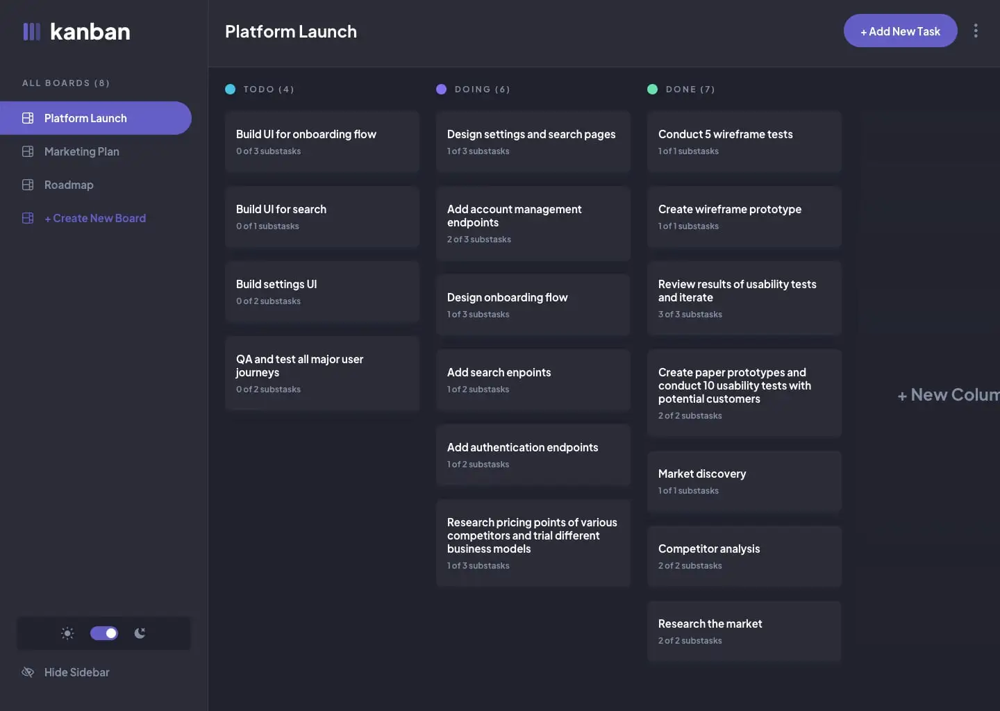

# Kanban

> [Kanban](https://kanban-sigma-six.vercel.app/) is fully-functional task management app.



## Installation
```bash
  npm install
```
## Development setup
```bash
  npm next start
```
## Usage example

- Boards
  - Clicking different boards in the sidebar will change to the selected board.
  - Clicking "Create New Board" in the sidebar opens the "Add New Board" modal.
  - Clicking in the dropdown menu "Edit Board" opens up the "Edit Board" modal where details can be changed.
  - Columns are added and removed for the Add/Edit Board modals.
  - Deleting a board deletes all columns and tasks and requires confirmation.
- Columns
  - A board needs at least one column before tasks can be added. If no columns exist, the "Add New Task" button in the header is disabled.
  - Clicking "Add New Column" opens the "Edit Board" modal where columns are added.
- Tasks
  - Adding a new task adds it to the bottom of the relevant column.
  - Updating a task's status will move the task to the relevant column. If you're taking on the drag and drop bonus, dragging a task to a different column will also update the status.

## Tech Stack

- [NEXT 13.4](https://nextjs.org/docs);
- [TypeScript](https://www.typescriptlang.org/docs/);
- [React-Hook-Form](https://react-hook-form.com/);
- [Redux](https://redux-toolkit.js.org/);
- [Redux-Saga](https://redux-saga.js.org/);
- [Styled-Components](https://styled-components.com/);